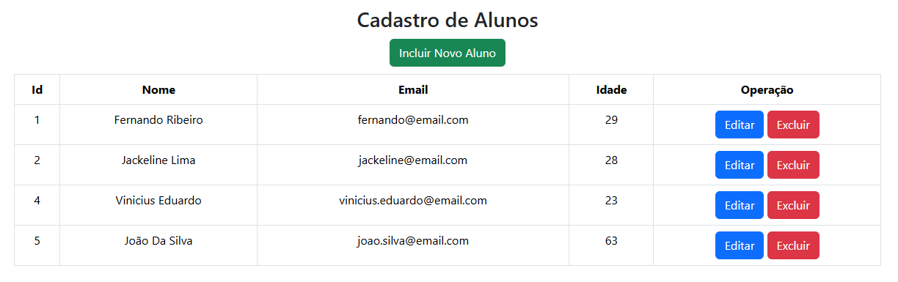
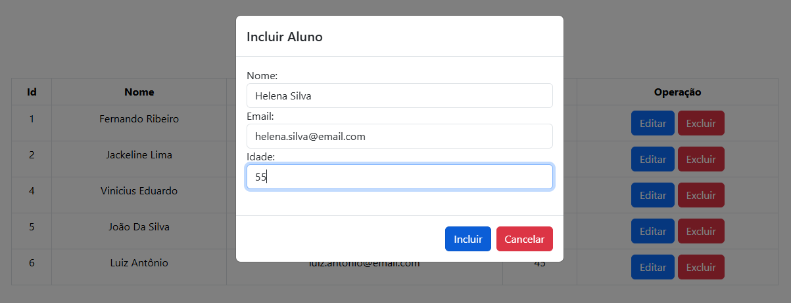
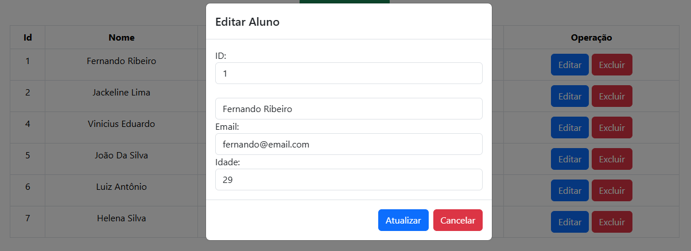
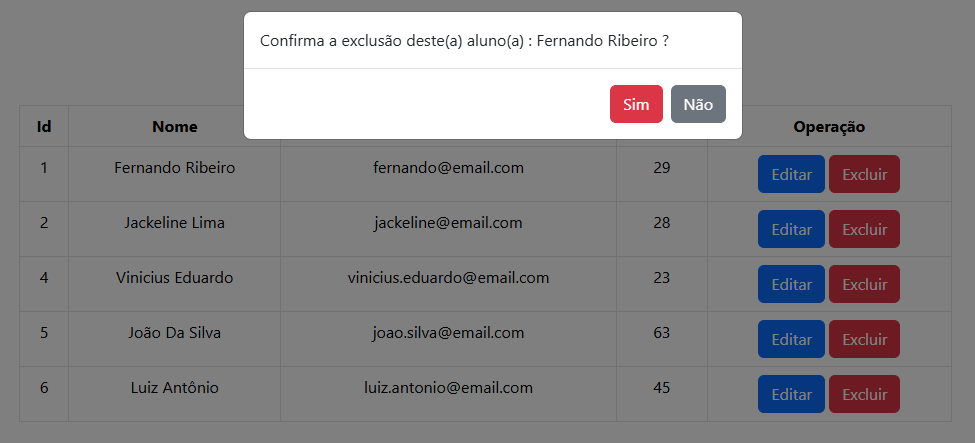

# Alunos Fullstack

Projeto desenvolvido com API .NET Core e Front-end React.

## 📋 Sobre o Projeto

Alunos FullStack é um projeto desenvolvido para demonstrar conhecimentos em desenvolvimento full stack utilizando **.NET 8**, **Entity Framework Core**, **SQL Server** e **React**. A aplicação consiste em uma API REST responsável pelo gerenciamento de alunos e um front-end que consome os serviços da API através do **Axios**, permitindo realizar operações de cadastro, consulta, atualização e exclusão de registros.

### Principais Recursos

- Listar alunos.
- Inserir aluno.
- Editar aluno.
- Excluir aluno.

## 🛠️ Tecnologias Utilizadas

- C#
- AspNet Core Web API
- .NET Core 8.0
- Entity Framework Core
- SQL Server
- React
- Vite
- Bootstrap

## 📂 Estrutura do Projeto

```text
AlunosFullStack/
│
├── api/
│   ├── AlunosAPI/
│
├── docs/
│
├── front/
    ├── alunos-front/
```

## 📸 Interface

### Tela Principal



### Inserção



### Edição



### Exclusão



## ⚠️ Observações

- Projeto em desenvolvimento.

## 👨‍💻 Autor

Fernando Ribeiro
